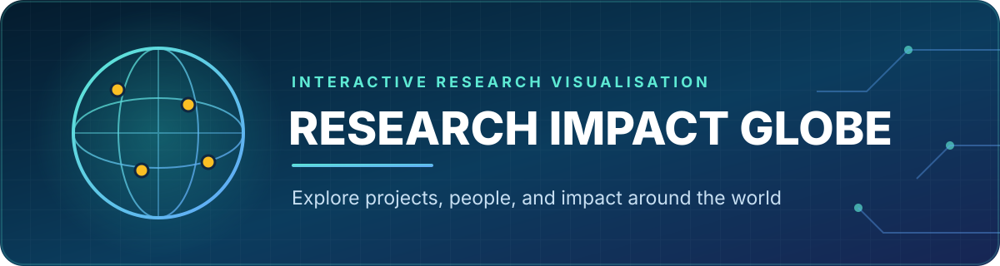

<p align="center">
  
</p>

<p align="center">
  An interactive 3D world map for discovering research projects, people, and impact across countries.
</p>

<p align="center">
  
  
  
  
  
</p>

## Overview

**Research Impact Globe** transforms an international collection of research projects into an explorable digital experience. A continuously rotating orthographic globe highlights countries with associated projects, while animated markers, guided navigation, and rich project modals help visitors move from a global overview to individual stories.

The project combines geospatial visualisation with text, imagery, and video to make multidisciplinary research easier to discover and communicate.

## Highlights

- 🌍 Rotating and zoomable 3D-style world globe
- 📍 Animated geographic markers for project locations
- 🟡 Visual highlighting for countries represented in the dataset
- 🔎 Country selection with smooth focus and zoom behaviour
- 🖼️ Project galleries with descriptions, images, and video support
- 🔥 Curated **Hot Projects** panel for featured work
- 🧭 Sidebar navigation for browsing project categories and locations
- 📱 Component-based interface built with Chakra UI

## How It Works

1. `HomePage.jsx` initialises the amCharts map using an orthographic projection.
2. `cities.js` supplies coordinates for animated location markers.
3. `country.js` groups project records by country.
4. Selecting a country rotates and zooms the globe to the relevant region.
5. Project information is presented through Chakra UI modals and Swiper galleries.

## Tech Stack

| Layer | Technologies |
|---|---|
| Interface | React 18, Chakra UI, Emotion, Framer Motion |
| Mapping | amCharts 5, amCharts Geodata |
| Media | Swiper, ReactPlayer |
| Data & services | Local JavaScript datasets, Axios, Firebase |
| Tooling | Create React App, npm / Yarn |

## Project Structure

```text
src/
├── assets/                 # Project imagery, flags, and branding
├── components/             # Modals, navigation, featured projects
├── data/
│   ├── cities.js           # Map marker coordinates
│   ├── country.js          # Country-to-project content
│   └── image_videosExport.js
├── page/HomePage.jsx       # Globe rendering and interaction logic
├── App.js
└── index.js
```

## Getting Started

### Prerequisites

- Node.js 16 or later
- npm or Yarn

### Installation

```bash
git clone https://github.com/salmasoo88/Myproject.git
cd Myproject
npm install
npm start
```

Open [http://localhost:3000](http://localhost:3000) in your browser.

## Available Scripts

| Command | Purpose |
|---|---|
| `npm start` | Start the local development server |
| `npm test` | Launch the test runner in watch mode |
| `npm run build` | Create an optimised production build |
| `npm run eject` | Expose Create React App configuration |

## Content Model

Project records can include a location, title, principal investigator, description, image, and video. To add a project, place its media in `src/assets/`, export it through `image_videosExport.js`, and add the corresponding entry to `country.js`.

> [!NOTE]
> Several dataset entries reference local video files. Those media files are not included in the current public repository, so they must be restored or the related imports removed before producing a complete build.

## Contribution Guide

Useful contributions to this project include:

- validating project records before they are added to the globe dataset;
- adding accessible labels and keyboard navigation to interactive map controls;
- introducing fallback behaviour for unavailable images and videos; and
- testing country selection, rotation, zoom, and modal navigation.

Keep data changes focused, document any new media assets, and verify the globe interaction locally before submitting an update.

## Project Status

This repository is a research-communication prototype. It demonstrates interactive geospatial storytelling and is suitable for further work on responsive behaviour, accessibility, content management, testing, and deployment.

## Maintainer

**Salma Soofiyan** — Cybersecurity, AI & Machine Learning Researcher<br>
[GitHub](https://github.com/salmasoo88) · [LinkedIn](https://www.linkedin.com/in/salma-soofiyan-92033011b/)
